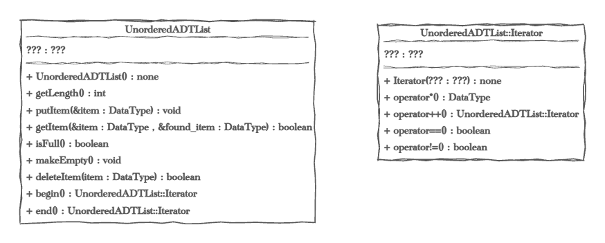

[comment]: <> (Do not remove this!)


➡️ [Click here to view the autograder workflow](../../actions/workflows/classroom.yml)
# Lab Assignment: Unordered Lists in C++

## Overview

In this lab, you will implement two versions of an unordered list Abstract Data Type (ADT): one using an array and the other using a linked list. Both implementations will share the same interface but will differ in their internal implementation. You will also implement iterators for both versions to facilitate traversal of the lists in a manner consistent with C++ Standard Library conventions.

Additionally, you will create separate drivers (`ArrayListDriver.cpp` and `LinkedListDriver.cpp`) for each implementation. These drivers must demonstrate the functionality of the ADT methods with two different data types: one primitive type such as `int` or `std::string`, and one user-defined type, specifically the `Customer` class provided in the lab. The drivers should also create `Customer` objects from the `Customers.txt` file and use them in the list.

This assignment strengthens your understanding of templates, iterators, dynamic memory management, and algorithm efficiency.

### Concepts Covered

- Templated classes
- Array-based and linked list-based data structures
- Iterator implementation for traversal
- Dynamic memory management (linked list)
- Operator overloading for iterators

---

## Lab Objectives

By completing this lab, you will:

1. Implement templated unordered lists in C++ with two underlying structures: arrays and linked lists.
2. Create iterators for both implementations to traverse the lists efficiently.
3. Handle edge cases, such as accessing elements beyond the list boundaries.
4. Demonstrate ADT functionality with two data types.
5. Understand the differences in performance and memory usage between arrays and linked lists.
6. Adhere to modern C++ coding practices, including exception safety and proper commenting.

---

## Grading Rubric (100 points possible)

60 points autograded, 40 points hand graded.

| Points | Requirements                                           |
| ------ | ------------------------------------------------------ |
| 20     | ArrayADTList Methods Implementation                    |
| 20     | LinkedADTList Methods Implementation                   |
| 10     | ArrayADTList Iterator Implementation                   |
| 10     | LinkedADTList Iterator Implementation                  |
| 10     | Driver Demonstrating Primitive Data Type Usage         |
| 10     | Driver Demonstrating Customer Object Usage             |
| 20     | Good Coding Practices (Including Documenting Comments) |

---

## Unordered ADT List Interface



Both lists have the exact same interface the prototype methods are:

You may not change the interface. The implementation however is completely up to you.

***Constructor*** Your constructor should set the initial state of the object correctly setting defaults for all properties.

***Destructor*** A destructor is required in the linked list version to ensure that memory leaks are not created when the ADT is deleted.

***int getLength();*** Returns the length of the list.

***void putItem(const DataType &item);*** Inserts the value of the item into the list. Throws a FullError if the list is full. ***Note:*** FullError is only needed in the array implementation. Make sure you understand why.

***bool getItem(const DataType &item, DataType &found_item);*** Finds the item in the list and assigns the value to the found_item.  Returns true if the item is in the list and false if it is not.

***bool isFull();*** Returns true if the list is full, false if it is not.

***void makeEmpty();*** Sets the list to empty.

***bool deleteItem(const int &item);*** Removes the item from the list.Returns true if the item was in the list and false if it was not.

***Iterator begin();*** Returns an Iterator object pointing to the first item in the list.

***Iterator end();*** Returns an Iterator object pointing to the last item in the list.

***Note:*** the order of your list does not matter, but it must have an order for the begin and end methods to function. 

***For the linked list version only you need to add :***
* A Copy Constructor
* An Assignment operator
* Destructor

You don't need any of these for the Array version.  Be sure you understand why.

#### The Interface (public methods) are set, but you are free to add as many private methods as you'd like to make you code more readable and/or efficient.

---

## Instructions

### Core Requirements

#### **Part 1: ArrayADTList Implementation**

1. **Declare a Class Template:**

    - Define a templated class `ArrayADTList<DataType>`.

2. **Core Methods:**

    - Implement the following member functions:
        - `int getLength() const;`
        - `void putItem(const DataType& item);`
        - `bool getItem(const DataType& item, DataType& found_item) const;`
        - `bool isFull() const;`
        - `void makeEmpty();`
        - `bool deleteItem(const DataType& item);`

3. **Iterator Implementation:**

    - Define a nested `Iterator` class that:
        - Supports dereferencing (`operator*`), pre-increment (`operator++`), and equality comparison (`operator==`, `operator!=`).
        - Traverses the array using internal pointers or indices.
        - Throws a std::out_of_range exception if operator* is called when the iterator is at the end of the list.
    - Add `begin()` and `end()` methods to `ArrayADTList` to return appropriate iterators.

#### **Part 2: LinkedADTList Implementation**

1. **Declare a Class Template:**

    - Define a templated class `LinkedADTList<DataType>`.

2. **Core Methods:**

    - Implement the following member functions:
        - `int getLength() const;`
        - `void putItem(const DataType& item);`
        - `bool getItem(const DataType& item, DataType& found_item) const;`
        - `void makeEmpty();`
        - `bool deleteItem(const DataType& item);`

3. **Rule of Three:**

    - Implement:
        - A destructor to release dynamically allocated memory.
        - A copy constructor for deep copying.
        - An assignment operator.

4. **Iterator Implementation:**

    - Define a nested `Iterator` class that:
        - Supports dereferencing (`operator*`), pre-increment (`operator++`), and equality comparison (`operator==`, `operator!=`).
        - Traverses the linked list by following node pointers.
        - Throws a std::out_of_range exception if operator* is called when the iterator is at the end of the list.
    - Add `begin()` and `end()` methods to `LinkedADTList` to return appropriate iterators.

#### **A Note about the `typename` keyword**
The `typename` keyword is necessary in certain contexts to clarify that a name refers to a type rather than a static member or value. We'll need to use it for the definition of our templated methods that return an `LinkedADTList<DataType>::Iterator`.

- **Dependent Names**:
   - Syntax:
     ```cpp
     typename LinkedADTList<DataType>::Iterator
     ```
     `LinkedADTList<DataType>` depends on the template parameter `DataType`, meaning its definition is not fully known until the template is instantiated. Without `typename`, the compiler cannot determine whether `Iterator` is a type or a static member of `LinkedADTList`.

- **Disambiguation**:
   - The compiler needs `typename` to explicitly understand that `Iterator` is a type. Without it, the compiler might assume `Iterator` is a value or static member, leading to a compilation error.

- **Where `typename` is Needed**:
   - You must use `typename` before a dependent type name in the scope of a template class when defining methods or using nested types. Specifically when returning an Itorator from our templated class :
     ```cpp
     typename LinkedADTList<DataType>::Iterator& LinkedADTList<DataType>::Iterator::operator++() { 
     // your code goes here
     }
     ```

The `typename` keyword resolves ambiguity for the compiler, ensuring it interprets the identifier as a type in template-dependent contexts. 

### **Driver Requirements**

For each implementation, create a separate driver file:

#### **ArrayListDriver.cpp**

1. **Primitive Data Type:**

    - Demonstrate the functionality of the `ArrayADTList` class using a simple data type, such as `int` or `std::string`.

2. **Customer Class:**

    - Demonstrate the `ArrayADTList` class using the `Customer` object.
    - Load `Customer` objects from the provided `Customers.txt` file.

#### **LinkedListDriver.cpp**

1. **Primitive Data Type:**

    - Demonstrate the functionality of the `LinkedADTList` class using a simple data type, such as `int` or `std::string`.

2. **Customer Class:**

    - Demonstrate the `LinkedADTList` class using the `Customer` object.
    - Load `Customer` objects from the provided `Customers.txt` file.

### **Example Iterator Usage**

```cpp
#include "ArrayADTList.h"
#include "LinkedADTList.h"
#include "Customer.h"
#include <iostream>
#include <fstream>

int main() {
    ArrayADTList<int> arrayList;
    LinkedADTList<Customer> linkedList;

    // Demonstrate with integers
    arrayList.putItem(10);
    arrayList.putItem(20);
    arrayList.putItem(30);

    for (auto it = arrayList.begin(); it != arrayList.end(); ++it) {
        std::cout << *it << " ";
    }

    // Load customers from file
    std::ifstream customerFile("Customers.txt");
    std::string line;
    while (std::getline(customerFile, line)) {
        Customer customer(line);
        linkedList.putItem(customer);
    }

    for (const LinkedADTList<Customer>::Iterator& customer : linkedList) {
        std::cout << customer << "\n";
    }

    return 0;
}
```

---

## Submission

1. **Driver Requirements:**

    - Your drivers (`ArrayListDriver.cpp` and `LinkedListDriver.cpp`) should demonstrate all implemented features of both `ArrayADTList` and `LinkedADTList` using two data types.
    - Copy the output from each driver to the corresponding text files: `ArrayADTListDriverOutput.txt` and `LinkedADTListDriverOutput.txt`.

2. **Style Guidelines:**

    - Follow clean coding practices.
    - Use Doxygen-style comments for all classes and methods.

3. **Code Submission:**

    - Push your completed code to the provided GitHub repository.

4. **GitHub Repository URL:**

    - Submit the URL of your GitHub repository in the lab assignment on Canvas.


#### The Interface (public methods) are set, but you are free to add as many private methods as you'd like to make you code more readable and/or efficient. 

You don't need ether of these for the Array version.  Be sure you understand why. 

### ADT Array List Hints
* The array version will need a MAX size, set it based on the maximum number of customers you will be loading. 
* Watch out for infinite loops.
* Know what your special cases are, like is the list empty with trying to add or remove an element. 

### ADT Linked List Hints
* Watch out for infinite loops.
* It's easy to create a memory leak and the tests will not test for that.  Be sure that for every 'new' in your code you has 'delete' where that node is deleted.
* Order matters! When you are looping over the linked list and/or deleting an item out of the linked list think about the order in which you do each step so that you are not setting the pointers incorrectly or trying to access memory you've already deleted.
* Know what your special cases are, like is the list empty with trying to add or remove an element.

### Style and Efficiency Count
* Doxygen-style Documenting comments are required for all classes and methods in the header file.
* Comment tricky parts of the code, deleteItem, getNextItem and others can have complicated code, explain what your code is doing.
* You need to make sure your efficiency is as good as the examples we reviewed in class.  You should not be moving around large amounts of data in the Array version or traversing the linked list more than is needed.
* Memory leaks are a real danger in the linked list version know where and when they can happen.
